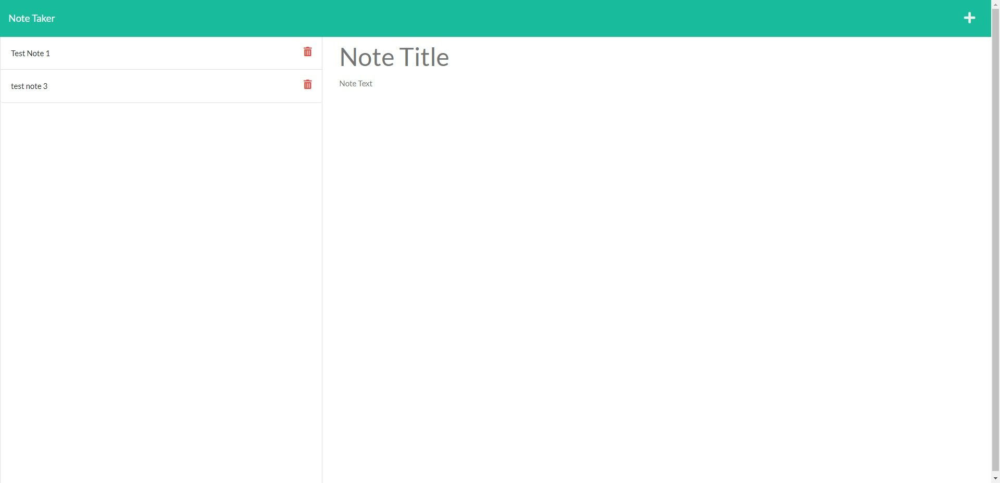

# Notekeeper
 

  ## Table of Contents
  * [Description](#description)
  * [Installation](#installation)
  * [Usage](#usage)
  * [Links](#links)
  * [License](#license)
  * [Contributing](#contributing)
  * [Questions](#questions)
  
  ## [Description](#table-of-contents)

 This repository contains a web app that takes and stores notes. It uses node.js, express.js, css, HTML, and Javascript.

  

  ## [Installation](#table-of-contents)

  To install: Clone the repository on your local machine and run 'npm install' to install all the node_modules. 

  ## [Usage](#table-of-contents)
You can view it locally by changing the port setting in server.js to 3001, running npm start in the command line and vewing it in your browser at localhost:3001
  Deploy to a web service with full code to have a continuous functioning application(this one is currently deployed on heroku)
 
  
  ## [Links](#table-of-contents)

  * [Repository](https://github.com/Thedanbrown/Notekeeper)
  * [Deployed app on Heroku](https://its-a-notekeeper.herokuapp.com/)

  ## [License](#table-of-contents)

  [MIT](https://opensource.org/licenses/MIT)

  ## [Contributing](#table-of-contents)
  No other contributing parties

  ## [Questions](#table-of-contents)

  You can contact me using the following links:

  [GitHub](https://github.com/Thedanbrown)

  [Email: thedanbrown@gmail.com](mailto:thedanbrown@gmail.com)
